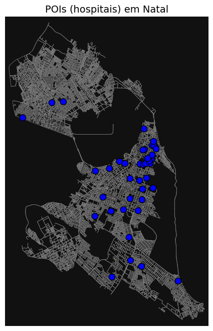
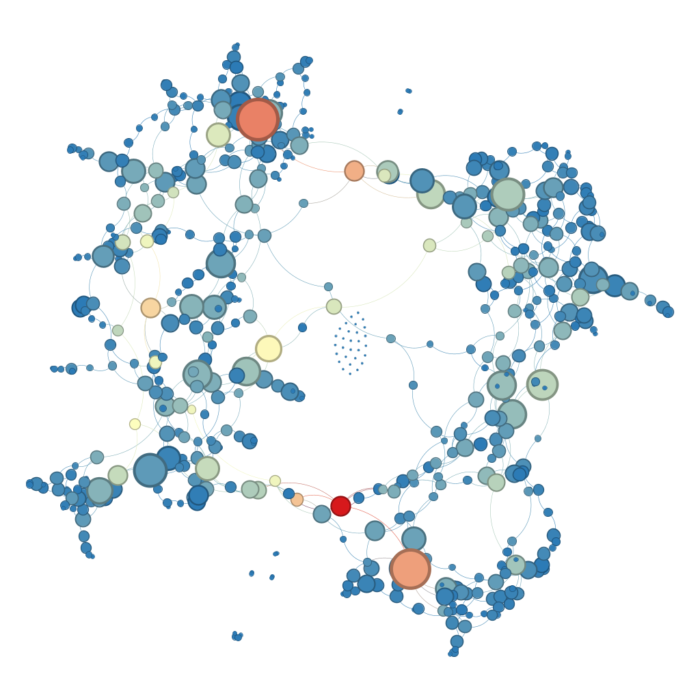
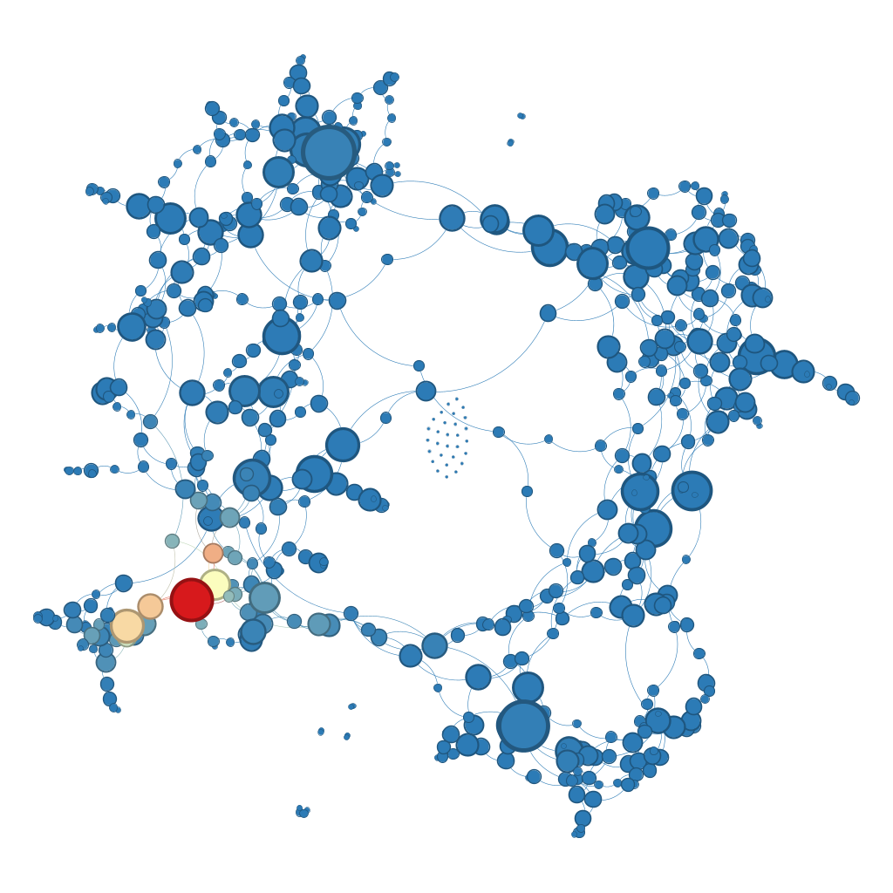
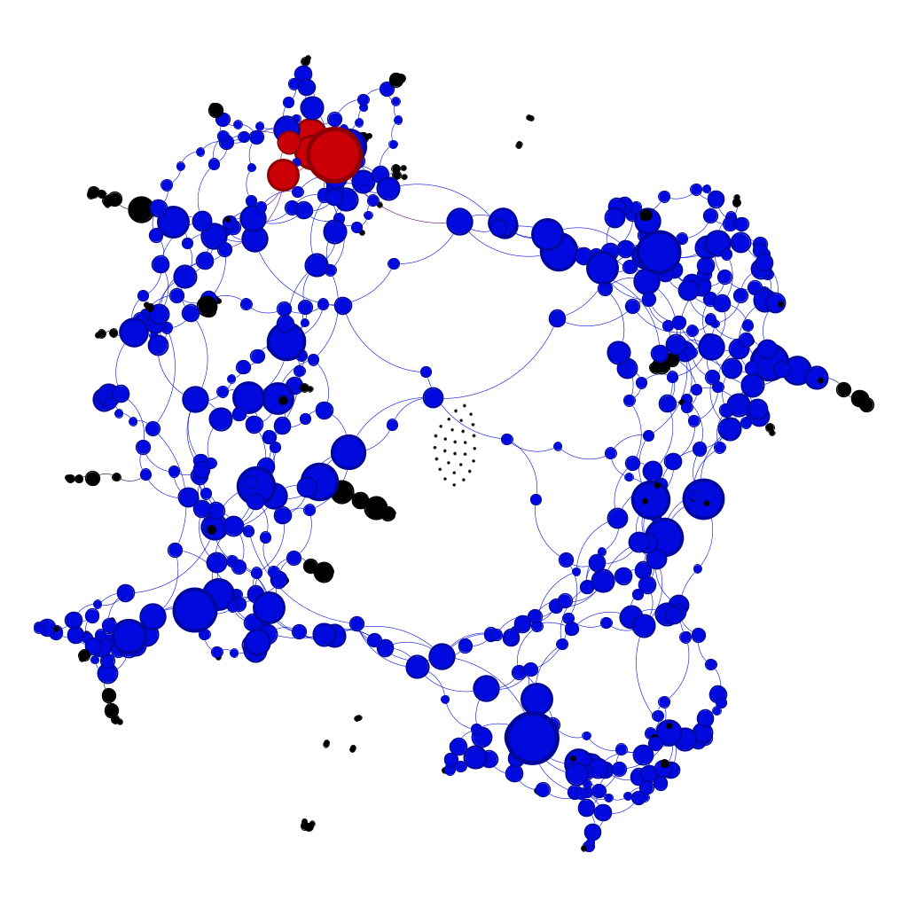
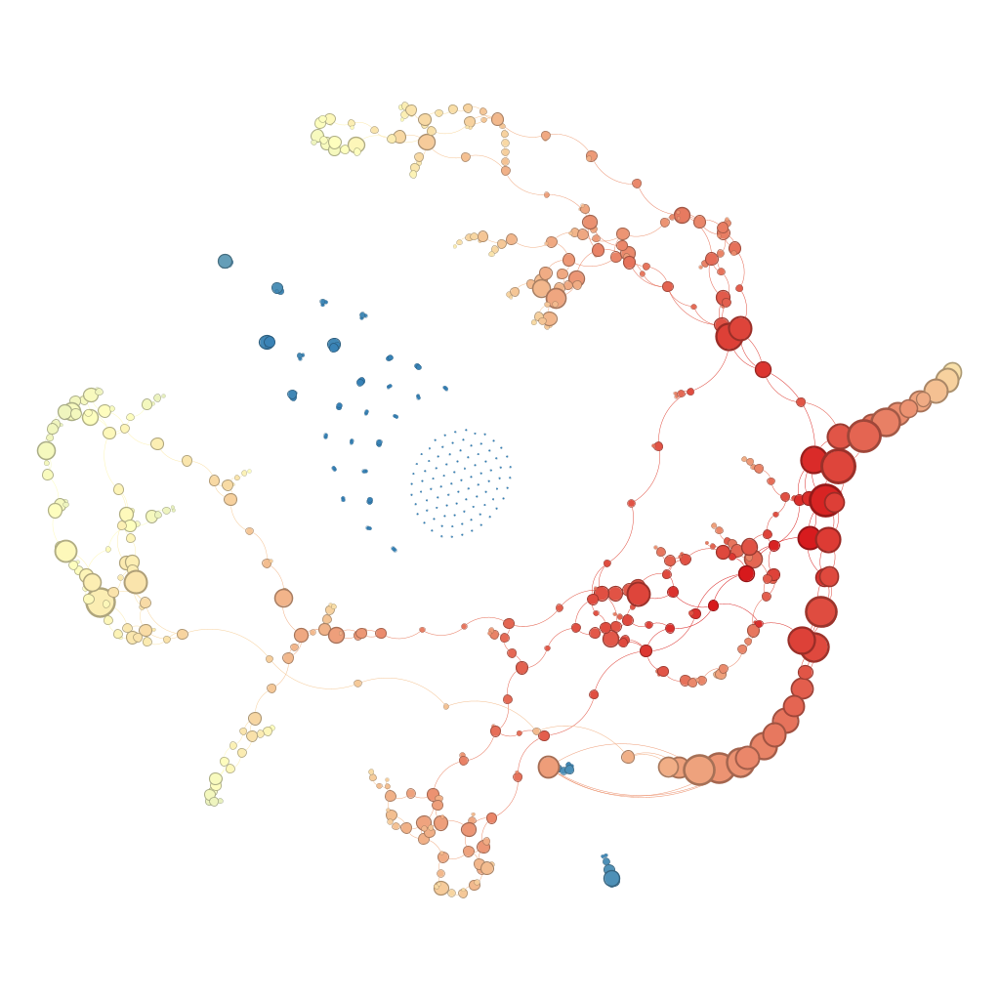
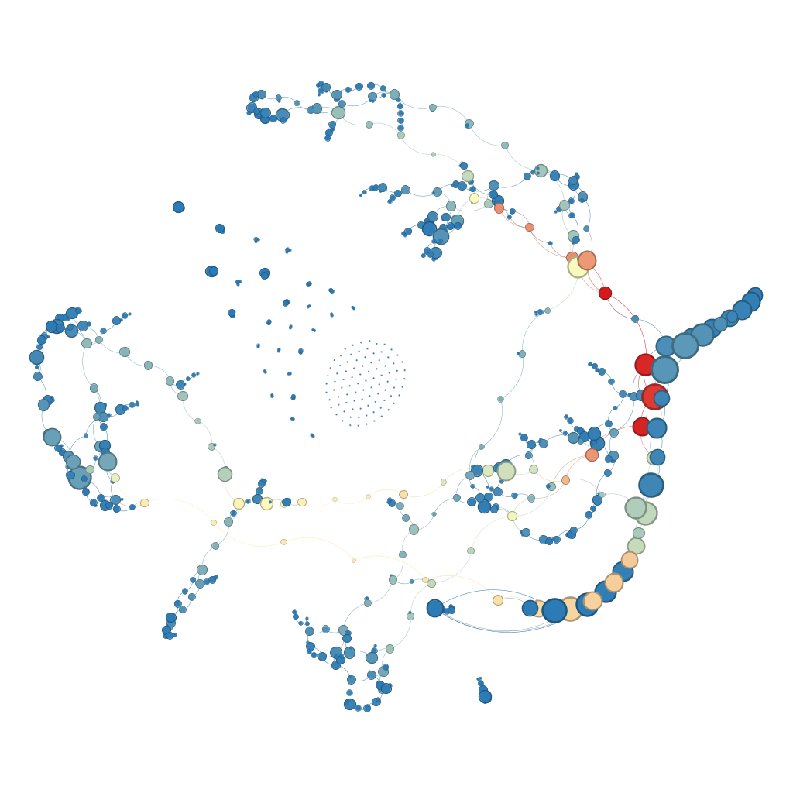
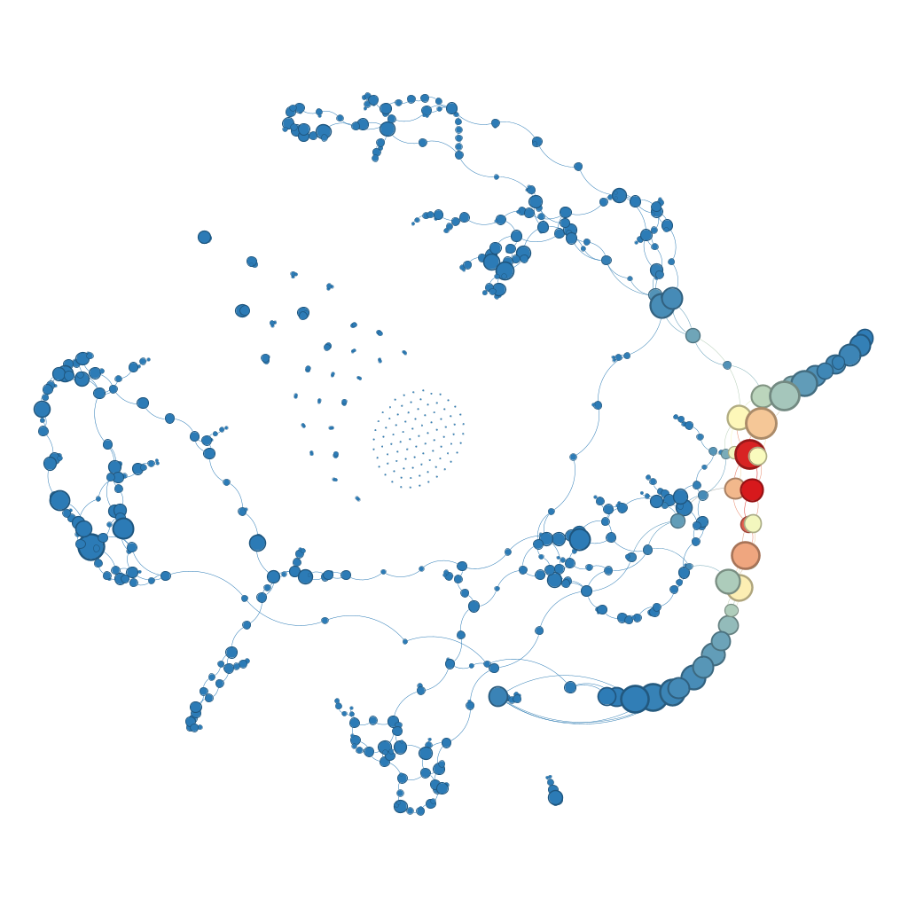
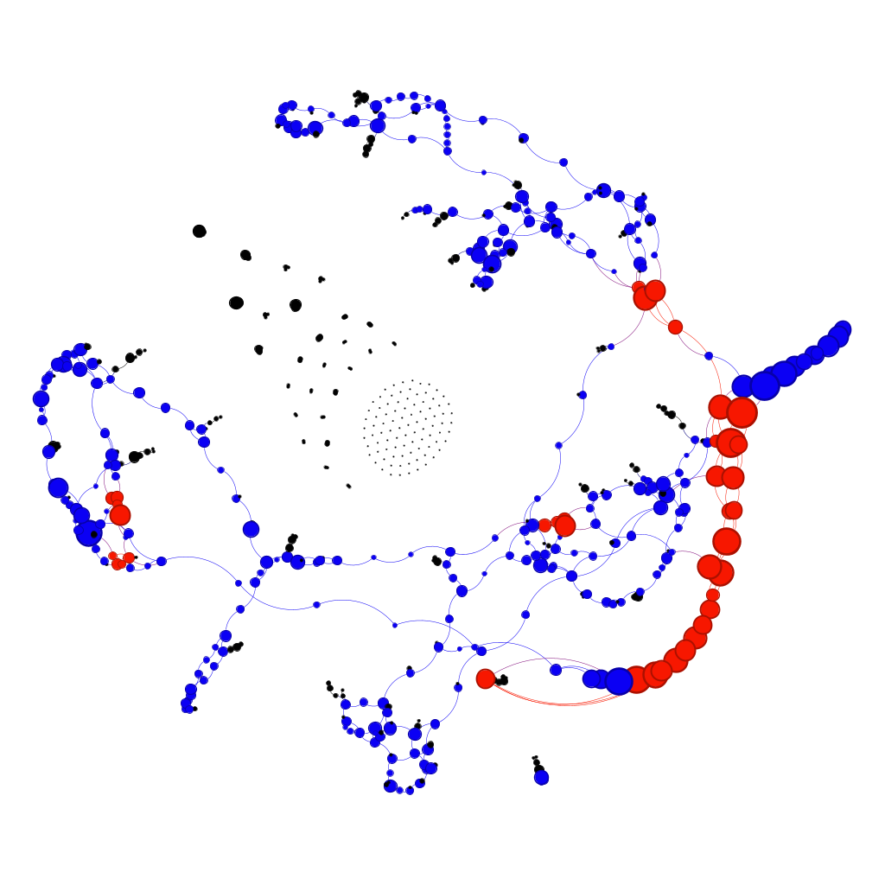
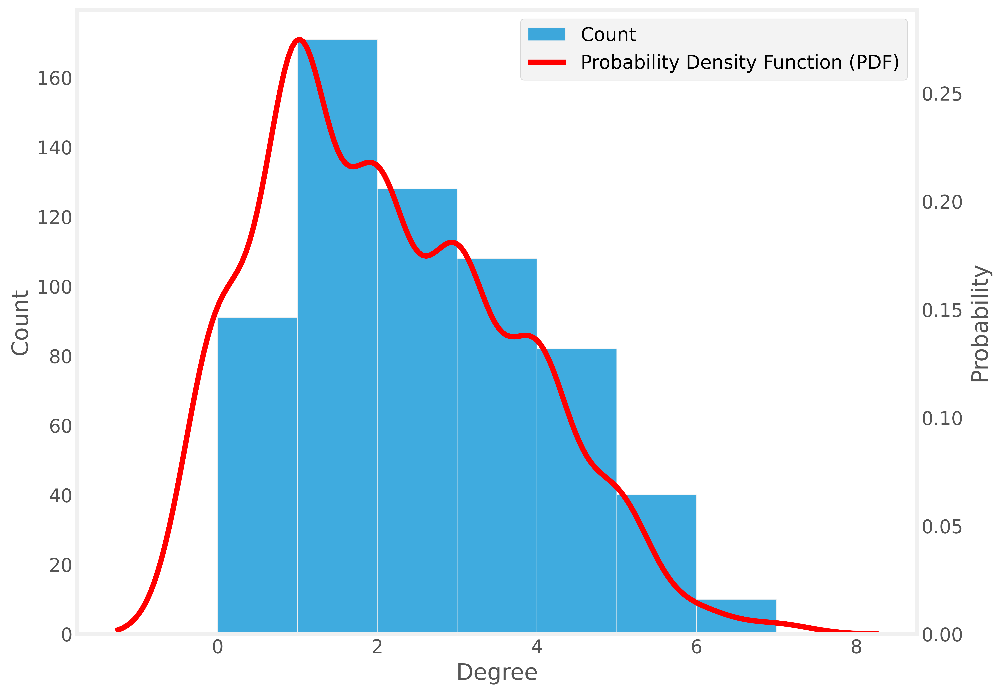

# Algoritmos e Estruturas de Dados II

**Autor: Juscelino Pereira de Araújo**

Este repositório destina-se ao compartilhamento dos artefatos produzidos na disciplina DCA3702 - Algoritmos e Estruturas de Dados II, ministrada pelo professor Ivanovitch Medeiros da Universidade Federal do Rio Grande do Norte (UFRN) no semestre 2025.1. Cada seção irá tratar de um diferente projeto desenvolvido ao longo do semestre.

## Projeto 1 - Redes Temporais de Coautoria

As redes de coautoria em trabalhos científicos são um importante ferramenta indicativa de colaboração entre pesquisadores, refletindo tanto a integração acadêmica quanto o compartilhamento do conhecimento produzido entre diferentes instituições. Por meio delas, é possível observar como o desenvolvimento científico se articula de maneira coletiva, favorecendo a inovação, o aumento da produtividade científica e a disseminação de ideias. Assim, a análise das redes de coautoria permite identificar pesquisadores mais influentes, grupos de pesquisa com maior consolidação e possíveis lacunas de colaboração, servindo como ferramenta estratégica para o planejamento de políticas científicas e acadêmicas.

Neste projeto é feita uma análise das redes de coautoria no âmbito do Programa de Pós-Graduação em Engenharia Elétrica e de Computação da Universidade Federal do Rio Grande do Norte (PPGEEC/UFRN) desde o ano 2010 até o presente. Tal análise é relevante por permitir uma compreensão aprofundada da evolução da colaboração entre seus docentes, discentes e parceiros externos. Esse tipo de estudo possibilita identificar tendências de pesquisa, áreas com maior interação científica e o impacto da produção acadêmica do programa ao longo do tempo. Além disso, ao mapear essas redes, pode-se avaliar o alcance e a inserção do PPGEEC no cenário nacional e internacional, bem como subsidiar ações que promovam uma maior integração entre pesquisadores e fortaleçam a excelência acadêmica do programa.

### Dados usados na análise

As análises são baseadas em vários arquivos no formato gexf. Cada um deles contém uma rede de coautoria do PPGEEC para um período específico. Os nós são os pesquisadores e as arestas indicam pesquisadores que são coautores em publicações científicas. Os grafos são os seguintes:
* 16 grafos anuais (individualmente para cada ano de 2010 a 2025);
* 4 grafos correspondentes aos períodos das avaliações quadrienais da Fundação Coordenação para o Aperfeiçoamento do Pessoal do Nível Superior - CAPES (2010-2012, 2013-2016, 2017-2020 e 2021 a 2024);
* 1 grafo geral (com todos os dados de 2010 a 2025).

### Evoluçao das redes de coautoria do PPGEEC ao longo dos anos

Uma primeira análise feita sobre os dados das redes de coautoria do PPGEEC é a sua evolução ao longo do tempo de acordo com algumas métricas. Foram escolhidas as seguintes para fundamentar a análise:
* Densidade;
* Número de vétices;
* Número de arestas;
* Número médio de vizinhos;
* Distribuição do número de vizinhos.

O gráfico a seguir mostra a evolução comparada, mediante séries temporais, entre as métricas de densidade, número de arestas, número de vértices e número médio de arestas. Os valores foram normalizados entre 0 e 1 para possibilitar uma comparação mais adequada. É possível ver uma tendência de crescimento até 2019 no número de vértices, número de arestas e número médio de vizinhos. A patir de 2020 passam a ser peceptíveis sinais de queda que muito provavelmente são os efeitos do início da pademia do novo coronavírus. Os dados referentes a 2025 são destoantes por estarem naturalmente incompletos, uma vez que essas análises estão sendo feitas em Abril de 2025.

O gráfico a seguir, do tipo *ridgeline*, traz uma estimativa das funções de densidade de probabilidade do número de vizinhos em cada uma das redes anuais. A cor da área sob a curva da distribuição de cada ano está relacionada à quantidade de arestas no grafo. Tal escolha foi feita partindo do princípio de que, ao analisar redes de coautoria, mais significativa que a quantidade de pesquisadores é a existência de colaboação entre os pesquisadores presentes. É interessante notar como essas distribuiçoes têm cauda longa à direita, um indicativo da presença de alguns poucos vértices com grau muito elevado. Essa característica de cauda longa à direita inclusive não é significativamente afetada no período da pandemia, indicando que pesquisadores com muitas colaborações mantiveram esse comportamento com o passar dos anos.

### Redes de coautoria do PPGEEC nos períodos referentes às avaliações quadrienais da CAPES

A seguir temos a análise do compotamento das redes do coautoria do PPGEEC durante os períodos das avaliações quadrienais da CAPES. Logo abaixo temos as visualizaçoes dos gafos referentes a esses períodos. Em cada caso, os cinco nós de maior grau são representados por bolas verdes e têm seus nomes destacados. Os demais são representados po bolas azuis. As arestas em geral são representadas por linhas na cor cinza. A exceção acontece quando a aresta liga dois pofessores permanentes do PPGEEC. Nesse caso a aresta é pintada de vermelho. O tamanho dos vétices é popocional ao númeo de vizinhos. Já a espessura das arestas é proporcional ao número de citações de trabalhos em que os dois pesquisadores são coautores.

Da observação dos grafos é possível perceber o aumento dos vértices, ao passo em que os cinco pesquisadores com mais colaborações não variam muito. Por exemplo, os professores Luiz Marcos Garcia Gonçalves e Marcelo Sampaio de Alencar aparecem destacados em todos os períodos. Já o professor Marcelo Augusto Costa Fernandes aparece em todos desde o quadriênio 2013-2016.

#### Rede de coautoria do PPGEEC no período 2010-2012

#### Rede de coautoria do PPGEEC no período 2013-2016

#### Rede de coautoria do PPGEEC no período 2017-2020

#### Rede de coautoria do PPGEEC no período 2021-2024

### Um subgrafo com vértices de alto grau e rede ego do vértice de maior grau

Por fim, a análise concentrou-se em analisar globalmente o período completo compreendido pelos dados: de 2010 até 2025. Assim, inicialmente é exibido a rede de coautoria completa, aos moldes das anteriores.

Muitos vértices estão sobrepostos e, a julgar pelo tamanho de algumas das bolas em verde, há uma discrepância muito grande entre os pesquisadores com mais e com menos colaborações. Isso está de acordo com o fato de que os pesquisadores que se destacavam em termos de coautorias nos períodos de avaliação quadrienal também estão destacados nesse novo grafo. Assim, entende-se que esses pesquisadores foram adquirindo mais e mais coautores ao longo do tempo. Por exemplo, com novos orientandos do PPGEEC.

Uma pergunta natural que surge é o que acontece quando se observa um subgrafo contendo apenas os vértices com uma determinada quantidade de vizinhos. Decidiu-se por construir um subgrafo contendo apenas aqueles nnós cuja quantidade de vizinhos fosse ao menos um desvio-padrão acima da média. Portanto, foram selecionados apenas os vértices com 60 vizinhos ou mais. O subgrafo gerado é mostrado a seguir.

O grafo possui bem menos vértices e, além disso, a diferença de tamanho entre as bolas não é tão grande como antes. Isso significa que existem muitos pesquisadores com poucos coautores em colaboração com os que possuem muitos coautores. Também é possível ver mais facilmente as arestas vermelhas. O que é natural, uma vez que se espera que os professores permanentes do PPGEEC estejam entre aqueles com mais coautores e que colaborem entre si. Com relação à densidade, a do subgrafo é de aproximadamente 0,23, enquanto o anterior tinha densidade aproximada de 0,0087. Tal diferença é explicada pela retirada de muitos vértices com poucas arestas. Isso faz a densidade do subgrafo ser bem maior.

O vértice com maior número de vizinhos no grafo geral corresponde ao professor Ricardo Alexsandro de Medeiros Valentim, com 401 coautores. A seguir é exibida a rede ego para esse vértice. É possível notar que existem vários grupos com poucos vértices de tamanho pequeno. Possivelmente eles se referem a grupos de pesquisa de temas muito específicos que não colaboram muito com outros grupos que trabalham junto ao professor Ricardo Valentim. 

Por fim, é analisada a rede ego referente ao nó correspondente ao professor Ricardo Valentim no subgrafo gerado anteriormente. É possível notar três grupos principais de coautores. Além disso, os quatro principais coautores desse professor na rede ego do grafo geral são os mesmos que se destacam na rede ego do subgrafo, indicando que esses pesquisadores têm conseguido manter muitas colaborações com outros pesquisadores que, por sua vez, também possuem vários coautores.

Maiores detalhes sobre as análises feitas podem ser encontrados neste [notebook](U1P1/U1P1.ipynb) e nos demais arquivos dessa [pasta](U1P1). Há também um [vídeo explicativo](https://youtu.be/sgsESlhtQgI) sobre o trabalho realizado.

## Projeto 2 - Análise de Assortatividade em Grafo de Ingredientes da Culinária Brasileira

Este trabalho consiste na análise da assortatividade de uma rede de ingredientes de pratos da culinária brasileira típicos das regiões Nordeste e Norte. Seu objetivo é compreender como o fato de dois ingredientes pertencerem a um mesmo tipo (carboidrato, proteína, fruta etc.) influencia no fato de eles aparecerem juntos em uma mesma receita. A amostra de receitas foi extraída de um livro publicado pelo Ministério do Meio Ambiente em 2019, contendo receitas típicas das cinco regiões brasileiras. O livro de receitas pode ser abtido [neste link](https://redesans.com.br/rede/wp-content/uploads/2019/08/Livro-de-Receitas-03-07-2019.pdf). Utilizou-se um modelo de linguagem para extrair receitas desse livro referente as regiões Nordeste e Norte. Apesar de serem extraídas manualmente as 94 páginas correspondentes a essasreceitas, a partir do [prompt](U1T2/llm_info.md) utilizado só foi possível extrair 54 receitas para a montagem de um arquivo csv com as seguintes características:
* Uma linha para cada receita;
* Primeira coluna com o nome da receita;
* Segunda coluna com a lista de ingredientes;
* Terceira coluna com o tipo do ingrediente, podendo ser proteína, carboidrato, vegetal, fruta, laticínio, gordura, condimento ou outro.

  O modelo de linguagem ntroduziu o tipo 'bebida', que foi mantido. A partir desse csv, foi construído um grafo em que os nós são os vértices e dois nós estão unidos por uma arestas se aparecem juntos em uma receita. Abaixo seguem algumas visualizações desse grafo.

O grafo a seguir possui layout *spring* e cada ingrediente está representado em uma cor referente ao tipo:
* vegetal: verde;
* fruta: vermelho;
* laticínio: amarelo;
* condimento: rosa;
* proteína: roxo;
* carboidrato: azul;
* gordura: laranja;
* bebida: ciano;
* outro: cinza.

O grafo a seguir é do tipo circular, agrupando os ingredientes ao longo da circunferência Aqui é possível mais claramente diferenciar as arestas que unem ingredientes de um mesmo tipo ou de tipos distintos. Vale salientar que as cores aqui não seguem o mesmo padrão do gráfico anterior. 

A partir da análise visual e do fato de que o coeficiente de assortatividade é de aproximadamente 0,093, conclui-se a partir da amostra de receitas utilizada que a combinação dos ingredientes se dá de forma aleatória. No grafo no layout de spring não é possível ver aglomerados distintos de ingredientes. E no grafo circular é possível ver tanto arestas unindo ingredientes de mesmo tipo como de tipos distintos.

Maiores detalhes sobre as análises feitas podem ser encontrados neste [notebook](U1T2/ingredientes.ipynb) e nos demais arquivos dessa [pasta](U1T2). Há também um [vídeo explicativo](https://www.loom.com/share/97718dae3536435e86644450bbfb69b0?sid=9f8a3ab3-4dc3-4234-b88b-2f83fe55f895) sobre o trabalho realizado.

## Projeto 3 - Elaboração de estratégia de rotas usando Dijkstra e A*

Este projeto consiste em uma tentativa de encontrar uma maneira eficiente de fazer com que dez colaboradores saiam do Centro de Controle de Zoonoses de Natal, percorram ao todo sessenta e cinco pontos de coleta e retornem ao ponto inicial. Para isso, serão avaliadas diferentes abordagens envolvendo os algoritmos de Dijkstra e A*. Os pontos de coleta estão disponíveis nesta [planilha](U2T2/centroid_filtered.csv). Para a aplicação dos algoritmos mencionados, as vias de Natal foram mapeadas em um grafo construído a partir das bibliotecas NetworkX e OSMnx.

### Distribuição dos pontos de coleta seguindo lógica espacial

Uma primeira forma de dividir os pontos de coleta entre os colaboradores é simplesmente sorteá-los de forma o mais igualitária possível. E a partir de uma sequência de pontos, tentar percorrê-los usando a menor distância possível, partindo da central de coletas e a ela retornando ao final. Em uma segunda divisão é utilizado um critério de distribuição espacial dos pontos de coleta. Busca-se deixar cada colaborador com aproximadamente 6 pontos de coleta, podendo variar de 4 a 8. Todos os pontos de coleta de um bairro estão com um mesmo colaborador. Quando não há muitos pontos em um bairro, um colaborador pode ficar com dois ou mais bairros, quase sempre da mesma zona -- à exceção do colaborador que fica com os bairros Planalto (Oeste) e Pitimbu (Sul). Excepcionalmente, um colaborador fica com todos os bairros da zona Leste.

* Colaborador 1: bairro Nossa Senhora da Apresentação;
* Colaborador 2: bairro Lagoa Azul;
* Colaborador 3: bairros Igapó e Potengi;
* Colaborador 4: bairros Pajuçara e Redinha;
* Colaborador 5: bairro Guarapes;
* Colaborador 6: bairros Nazaré, Quintas e Bom Pastor;
* Colaborador 7: bairros Felipe Camarão e Cidade Nova;
* Colaborador 8: bairros Planalto e Pitimbu;
* Colaborador 9: bairros Candelária, Lagoa Nova e Nova Descoberta;
* Colaborador 10: zona Leste (bairros Alecrim, Tirol, Ribeira, Areia Preta e Santos Reis).

### Construção das rotas

Foram utilizadas sete estratégias de construção da rotas dos colaboradores. A primeira é a abordagem aleatória, mencionada na seção anterior, em que cada colaborador recebeu uma quantidade de pontos de forma aleatória. Aqui, os pontos -- para um mesmo colaborador -- são percorridos em ordem aleatória, seguindo a menor distância entre dois deles. As outras seis estratégias representam os usos dos algoritmos de Dijkstra e A* quando se ponderam as arestas pelo comprimento, tempo gasto ou emissão de CO2. 

### Avaliação das rotas

Cada uma das estratégias é avaliada segundo um desses três critérios: distância total percorrida (comprimento em metros), tempo total gasto (em segundos) e emissão de CO2 (em gramas por litro). Em cada caso, são somados os resultados da rota de cada colaborador. Na tabela a seguir temos a avaliação de cada uma das estratégias.

|Estratégia \ Métrica|Comprimento \(m\)|Tempo \(s\)|CO2 \(g/L\)|
|---|---|---|---|
|Aleatória|984640\.4855268182|78640\.54250408731|319178\.6340446898|
|Dijkstra (comprimento)|398911\.5808527714|33188\.60923305644|125995\.21112948703|
|Dijkstra (tempo)|419209\.17341668124|29918\.822116970558|135639\.8562440728|
|Dijkstra (CO2)|406232\.3699919473|34874\.13324147001|123727\.28601796925|
|A* (comprimento)|398911\.5808527714|33188\.60923305644|125995\.21112948703|
|A* (tempo)|419209\.17341668124|29918\.822116970558|135639\.8562440728|
|A* (CO2)|406232\.3699919473|34874\.13324147001|123727\.28601796925|

Com base na tabela acima, é possível notar que à exceção da abordagem aleatória, todas as estratégias tiveram desempenho semelhante em termos de distância percorrida e emissão de CO2. Se usarmos o critério da diferença relativa, não há discrepâncias maiores que 5% nos resultados avaliados. Já com relação ao tempo total gasto, é possível notar uma diferença maior, com desempenho melhor nas abordagens em que o tempo gasto foi usado como peso das arestas. Além disso, os resultados foram idênticos para os algoritmos de Dijkstra e A*. Sendo assim, a abordagem escolhida é a que constrói as rotas usando o algoritmo de Dijkstra utilizando o tempo gasto como peso das arestas.

### Visualização das rotas

As rotas obtidas na estratégia escolhida são exibidas abaixo. Na imagem, cada rota está representada por uma cor distinta.

A título de comparação, abaixo são exibidas as rotas obtidas na abordagem aleatória.

Maiores detalhes sobre as análises feitas podem ser encontrados neste [notebook](U2T2/U2T2.ipynb). Há também um [vídeo explicativo](https://www.loom.com/share/97718dae3536435e86644450bbfb69b0?sid=9f8a3ab3-4dc3-4234-b88b-2f83fe55f895) sobre o trabalho realizado.

## Projeto 4 - Árvore Geradora Mínima entre hospitais de Natal: aplicação do algoritmo de Kruskal

Este notebook apresenta uma solução para criar uma árvore geradora mínima (MST, do inglês *Minimum Spanning Tree*) entre hospitais da cidade de Natal, RN, Brasil. Para tanto, faz-se uso do algoritmo de Kruskal e da biblioteca OSMnx, que permite trabalhar com grafos de redes de ruas do OpenStreetMap. A solução apresentada aqui foi originalmente desenvolvida pelo professor Ivanovitch Silva, do Departamento de Engenharia de Computação e Automação (DCA) da Universidade Federal do Rio Grande do Norte (UFRN), e pode ser encontrada neste [repositório](https://github.com/ivanovitchm/datastructure/tree/main), na seção "Week 12".

Inicialmente usa-se a biblioteca OSMnx para obter a rede de ruas da cidade de Natal. Em seguida, é preciso obter os nós do grafo referentes aos pontos de interesse, ou seja, dos hospitais de Natal. A partir dessas coordenadas desses locais, são encontrados os nós do grafo que estão mais próximos desses pontos. A seguir temos a visualização dos pontos de interesse (hospitais) no grafo da cidade de Natal.

Constrói-se então um grafo completo, ou seja, com todos os nós diretamente interligados por arestas, cujos nós são referentes aos hospitais. A partir desse novo grafo, usa-se a biblioteca NetworkX para obter a MST procurada. A MST em um grafo ponderado nas arestas é a árvore que contém todos os nós desse grafo e que possui a menor soma total de comprimento (peso) das arestas. Para obter a MST existem alguns algoritmos já conhecidos, como o de Kruskal, o de Prim e o de Boruvka. A biblioteca NetworkX utiliza por padrão o algoritmo de Kruskal para encontrar a MST de um grafo. Esse algoritmo funciona da seguinte forma: considere um grafo G com N nós. Cria-se um conjunto F de árvores em G com exatamente N árvores, cada uma contendo um dos vértices. Para cada uma das arestas de G, percorrendo-as em ordem crescente, faz-se o seguinte:

* Se a aresta conecta duas árvores distintas de F, junte essas duas árvores em uma única a partir da inclusão dessa aresta;
* Senão, passe à aresta seguinte.

Esse procedimento é repetido até F conter uma única árvore com N-1 arestas. Essa árvore será a MST de G. Caso esgotem-se as arestas de G e não se chegue a uma única árvore em F, então é impossível criar a MST para esse grafo.

A seguir temos a visualização da MST encontrada. As arestas aparecem em vermelho.

Maiores detalhes sobre a construção da solução podem ser encontrados neste [notebook](U2T3/kruskal_natal.ipynb). Há também um [artigo](https://medium.com/@juscelinoaraujo/árvore-geradora-mínima-entre-hospitais-de-natal-aplicação-do-algoritmo-de-kruskal-6ed98edcc494) no Medium e um [podcast](https://notebooklm.google.com/notebook/d0acff8d-b5ee-4221-850c-3704515364e8/audio) sobre o trabalho realizado.

## Projeto 5 - Medidas de Centralidade

Este projeto tem por objetivo explorar o estudo de algumas medidas de centralidade através de uma rede anonimizada empregada para teste. Para esse estudo, foi usada a biblioteca NetworkX e o software Gephi. As medidas de centralidade têm a função de avaliar a relevância dos nós na rede segundo distintos critérios. Algumas das principais são:

* Centralidade de grau;
* Centralidade de proximidade;
* Centralidade de intermediação; e
* Centralidade de autovalores.

A **centralidade de grau** é uma medida diretamente proporcional ao número de conexões do nó. A partir dela é possível identificar nós que localmente possuem grande influência na rede. A **centralidade de proximidade** mede o quão rapidamente se pode ir de um nó até todos os outros. Assim, essa medida destaca nós que permitem a disseminação mais rápida de uma informação na rede. A **centralidade de intermediação** mede a fração de caminhos mais curtos que passam pelo nó em questão. Desse modo, essa medida destaca nós que podem ser vistos como "gargalos" na rede, ou seja, nós necessários para que a informação circule na rede. Já a **centralidade de autovalores** mede a relevância de um nó a partir de seus vizinhos. Assim, mesmo que um nó não tenha muitos vizinhos, a relevância desses vizinhos na rede pode fazer com que o nó em questão tenha alta medida de de centralidade de autovalores. Detalhes de como as medidas apresentadas aqui são calculadas e informações sobre outras medidas de centralidade podem ser obtidas nesta [página](https://pt.wikipedia.org/wiki/Centralidade) da Wikipédia.

A seguir, temos respectivamente as imagens do grafo colorindo os nós de acordo com três critérios: centralidade de proximidade, centralidade de intermediação e centralidade de autovalor. Em cada caso, quanto mais próximo do vermelho, maior o valor do atributo. O tamanho do nó é diretamente proporcional ao grau do nó, com exceção dos nós com grau zero, que estão do mesmo tamanho que os nós de grau 1. Dessa maneira, a informação trazida com o tamanho do nó é equivalente à da centralidade de grau. 

Da análise dessas figuras nota-se que quase todos os nós possuem alta centralidade de proximidade. A exceção são alguns nós isolados. O oposto ocorre com a centralidade de intermediação. Apenas alguns nós são representados por cores mais quentes, indicando que eles são gargalos na rede. E menos nós ainda possuem alta centralidade de autovalores, restringindo-se a um pequeno grupo de nós influentes (e com vizinhos influentes). Tanto no caso da centralidade de intermediação quanto da centralidade de autovalores, os nós com altos valores dessas medidas também possuem grau elevado, o que se nota pelo tamanho dos vértices.

A seguir temos uma imagem do grafo evidenciando o 3-core (em vermelho) e o 2-shell (em azul). Os demais nós estão em preto. O **k-core** de uma rede é o subgrafo maximal com todos os nós contendo ao menos k conexões dentro desse mesmo subgrafo. O **k-shell** é composto pelos nós que fazem parte do k-core mas não do (k+1)-core. Os k-core são uma maneira de representar de forma escalonada grupos influentes na rede. No grafo a seguir, é interessante notar que boa parte da rede pertence ao 2-shell da rede, restando apenas alguns poucos nós no 3-core.

O grafo está publicado no seguinte [link](https://juscelinoaraujo.github.io/netdeploy/network/). A cores representam comunidades distintas obtidas no Gephi para esta rede a partir do critério de modularidade.

Maiores informações podem ser obtidas na [pasta do projeto](U3P1/) ou neste [vídeo](https://www.loom.com/share/2de18783cb6a422bb2e5b53d85736c29?sid=e0c4dd3f-c618-42b4-956d-8f8c010ff4d1) explicativo.

## Projeto 6 - Análise da Rede de Resíduos de Aminoácidos da Proteína 1TUP

**Autores:**
* __Juscelino Pereira de Araújo__
* __Maria Eduarda Lima da Luz__
* __Daniel Bruno Trindade da Silva__

Este projeto tem por objetivo explorar o estudo de algumas medidas de centralidade através de uma rede anonimizada empregada para teste. Para esse estudo, foi usada a biblioteca NetworkX e o software Gephi. As medidas de centralidade têm a função de avaliar a relevância dos nós na rede segundo distintos critérios. Algumas das principais são:

* Centralidade de grau;
* Centralidade de proximidade;
* Centralidade de intermediação; e
* Centralidade de autovalores.

A **centralidade de grau** é uma medida diretamente proporcional ao número de conexões do nó. A partir dela é possível identificar nós que localmente possuem grande influência na rede. A **centralidade de proximidade** mede o quão rapidamente se pode ir de um nó até todos os outros. Assim, essa medida destaca nós que permitem a disseminação mais rápida de uma informação na rede. A **centralidade de intermediação** mede a fração de caminhos mais curtos que passam pelo nó em questão. Desse modo, essa medida destaca nós que podem ser vistos como "gargalos" na rede, ou seja, nós necessários para que a informação circule na rede. Já a **centralidade de autovalores** mede a relevância de um nó a partir de seus vizinhos. Assim, mesmo que um nó não tenha muitos vizinhos, a relevância desses vizinhos na rede pode fazer com que o nó em questão tenha alta medida de de centralidade de autovalores. Detalhes de como as medidas apresentadas aqui são calculadas e informações sobre outras medidas de centralidade podem ser obtidas nesta [página](https://pt.wikipedia.org/wiki/Centralidade) da Wikipédia.

A seguir, temos respectivamente as imagens do grafo colorindo os nós de acordo com três critérios: centralidade de proximidade, centralidade de intermediação e centralidade de autovalor. Em cada caso, quanto mais próximo do vermelho, maior o valor do atributo. O tamanho do nó é diretamente proporcional ao grau do nó, com exceção dos nós com grau zero, que estão do mesmo tamanho que os nós de grau 1. Dessa maneira, a informação trazida com o tamanho do nó é equivalente à da centralidade de grau. 

Da análise dessas figuras nota-se que quase todos os nós possuem alta centralidade de proximidade. A exceção são alguns nós isolados. O oposto ocorre com a centralidade de intermediação. Apenas alguns nós são representados por cores mais quentes, indicando que eles são gargalos na rede. E menos nós ainda possuem alta centralidade de autovalores, restringindo-se a um pequeno grupo de nós influentes (e com vizinhos influentes). Tanto no caso da centralidade de intermediação quanto da centralidade de autovalores, os nós com altos valores dessas medidas também possuem grau elevado, o que se nota pelo tamanho dos vértices.

A seguir temos uma imagem do grafo evidenciando o 3-core (em vermelho) e o 2-shell (em azul). Os demais nós estão em preto. O **k-core** de uma rede é o subgrafo maximal com todos os nós contendo ao menos k conexões dentro desse mesmo subgrafo. O **k-shell** é composto pelos nós que fazem parte do k-core mas não do (k+1)-core. Os k-core são uma maneira de representar de forma escalonada grupos influentes na rede. No grafo a seguir, é interessante notar que boa parte da rede pertence ao 2-shell da rede, restando apenas alguns poucos nós no 3-core.

O grafo está publicado no seguinte [link](https://juscelinoaraujo.github.io/netdeploy/1TUP/). A cores representam comunidades distintas obtidas no Gephi para esta rede a partir do critério de modularidade.

Maiores informações podem ser obtidas na [pasta do projeto](U3P2/) ou neste [vídeo](https://www.loom.com/share/2de18783cb6a422bb2e5b53d85736c29?sid=e0c4dd3f-c618-42b4-956d-8f8c010ff4d1) explicativo.

*Na elaboração dos textos que dão suporte às análises técnicas apresentadas neste documento, fez-se uso da ferramenta ChatGPT, da OpenAI. Todo o texto foi revisado minuciosamente pelo autor para garantir precisão e adequação ao contexto.*
